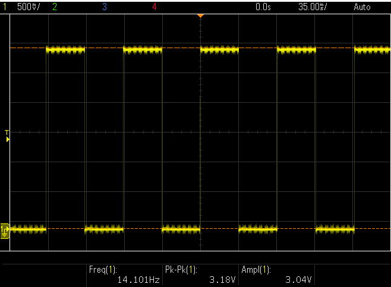
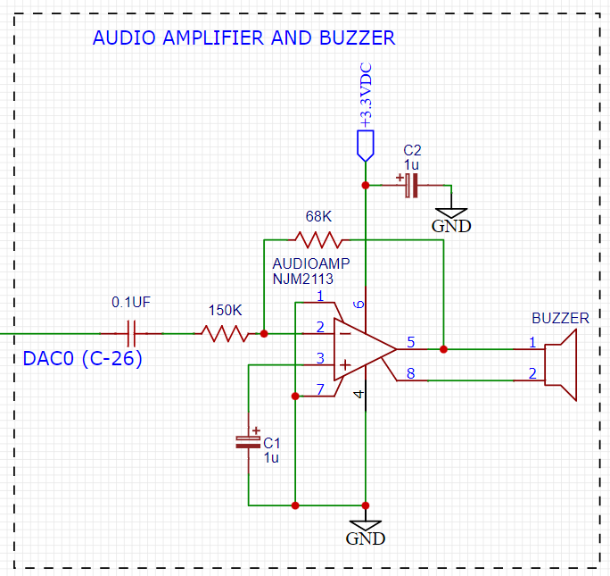

**************
Space Invaders
**************
.. _space-invaders:

.. note::

   This project is under active development.

Introduction
############
.. _introduction:

Released in 1978 by Taito, Space invaders was one of the earliest “shooting”
video games. The goal is to defeat waves of alien invaders that zig-zag towards
Earth with a laser cannon, and of course, to score as many points as possible
doing it. The invaders have lasers too and they shoot them, more or less at
random, at the laser cannon and the shields that have been deployed for the
player's defense. If the invaders reach Earth, the player loses. If the laser cannon
is destroyed (either by laser fire or by contact), the aliens regroup and attack the
next laser cannon. If all the aliens are destroyed, the player must face a new
wave of aliens that starts closer and moves faster.

    .. image:: images/space-invaders.png
        :width: 500
        :height: 350
        :alt: Space Invaders
        :align: center

Figure 1. Space InvadersTM

For this project, we use the LCD to display the laser cannon, the aliens and the
score. Shields are optional. One pushbutton is used to start the game and the
other is used to fire the laser cannon. The position of the laser cannon is
controlled by a potentiometer mounted near the display. Game parameters are
configured with a DIP switch.

Scope
#####
.. _scope:

1. Introduction: Provide a brief overview of the Space Invaders game, including its history and popularity.

2. Scope: Define the scope of the documentation, including what will be covered and what will not be covered.

3. Design Overview: Explain the high-level design of the game, including the game mechanics, graphics, and sound effects. This section should provide an overview of how the game works.

4. Design Alternatives: Discuss any design alternatives that were considered during the development of the game. This section should explain why certain design decisions were made and what the trade-offs were.

5. Design Details: Provide a detailed explanation of the design of the game, including the code and hardware used. This section should provide a step-by-step explanation of how the game works and how it interacts with the hardware components.

6. Testing: Detail the testing process for the game, including any bugs that were encountered and how they were fixed. This section should also explain how the game was optimized for performance.

7. Conclusion: Provide a summary of the game and the design process, including any final thoughts or recommendations for future development. This section should also highlight any major achievements or challenges that were encountered during the development process.

Design Overview
###############
.. _design_overview:

Requirements
************
.. _requirements:

1. The system shall run on an external 9v DC supply.
2. The system shall use a 64x128 pixel LCD.
3. The system shall have a reset button, a start button and a fire button.
4. The system shall have a potentiometer located near the bottom of the LCD to
   control the position of the laser cannon.
5. The laser cannon shall be seven pixels high. The width shall be to 7, 9, 11 or 13
   pixels depending on the DIP switch.
6. Invaders shall be 6-8 pixels high. Those on the front row shall be 10 pixels wide
   with 3 pixels between them. Those on the back row may be narrower.
7. The system shall continually display a 4-digit score that tallies the number of
   aliens destroyed by the current player.
8. When the start button is pressed, the score shall be set to zero and an initial
   wave of alien attackers shall commence (see #9, below).
9. At the beginning of each wave, the display shall show (a) the laser cannon (at
   the bottom of the screen), and (b) 2 rows of 8 alien space invaders (arrayed on
   the left side of the screen). On the initial wave, the invaders shall be as far from
   the laser cannon as possible.
10. Once the battle begins, the formation of invaders shall move to the right, firing
    lasers at random. When the invaders reach the side of the display, they shall
    move 8 pixels closer to the laser cannon and reverse direction.
11. The invaders shall move left or right one pixel at a time. The movement speed of
    the invaders shall be roughly inversely proportional to the number of invaders on
    the screen.
12. The system must be able to display up to 8 simultaneous laser bursts (i.e.
    projectiles) from the invaders and up to 4 simultaneous laser bursts from the
    player's laser cannon. All laser bursts are one pixel in size and move at a
    uniform speed. To improve visibility, trailing pixels (up to 7) should be displayed.
13. If a laser burst hits an invader, the invader shall be destroyed. If all invaders are
    destroyed, a new wave begins with the aliens arrayed 8 pixels closer than before
    (but no more than 16 pixels total), and the battle continues with the movement
    speed of the aliens increased.
14. If a laser burst hits the laser cannon or if an invader reaches the bottom row (i.e.
    the row containing the laser cannon), the the game is over and the words GAME
    OVER shall appear until the start button is pressed.
15. A sound shall be generated each time the laser cannon fires, each time an
    invader is destroyed or when the game is over. The sound for each of these
    three events shall be different and (except for game over) shall not exceed 250
    milliseconds.
16. When the start button is pressed, the display may also show four equally spaced
    14x8 pixel shields. If a laser burst hits a shield, one pixel of that shield should be
    removed.
17. If the front row of space invaders ever overlaps the shields, the shields are
    removed.
18. At random times, a flying saucer may cross the screen behind the array of
    invaders. Hitting the saucer with a laser burst scores 50 points.
19. Use three or four rows of invaders instead of two.
20. Use two images for the invaders and alternate (animate) them each time the
    invaders move (See below).

Dependencies
************
.. _dependencies:

1. External 9v DC supply
2. 64x128 pixel LCD
3. Reset button, start button, fire button
4. Potentiometer to control the position of the laser cannon
5. Laser cannon with height of seven pixels and variable width of 7, 9, 11, or 13 pixels depending on the DIP switch
6. Invaders with a height of 6-8 pixels and width of 10 pixels for front row and narrower for back row
7. 4-digit score displayed continuously
8. Initial wave of alien attackers when start button is pressed
9. Display showing laser cannon and 2 rows of 8 alien space invaders on the left side of the screen at the beginning of each wave
10. Invader formation moves to the right, fires lasers randomly, and reverses direction when reaching the side of the display
11. Invaders move left or right one pixel at a time, with movement speed roughly inversely proportional to the number of invaders on the screen
12. Display up to 8 simultaneous laser bursts from the invaders and up to 4 simultaneous laser bursts from the player's laser cannon
13. New wave with aliens arrayed 8 pixels closer and increased movement speed when all invaders are destroyed
14. Game over if a laser burst hits the laser cannon or if an invader reaches the bottom row, with "GAME OVER" displayed until the start button is pressed
15. Sound generated for firing laser cannon, destroying an invader, or game over, with different sounds for each event and a maximum length of 250 milliseconds.

Theory of Operation
********************
.. _theory_of_operation:

.. note::

   Add information about the theory of operation here.

Design Alternatives
*******************
.. _design_alternatives:

.. note::

   Add information about the design alternatives here.

Design Details
##############
.. _design_details:

This section addresses the design in detail, both what it is and why. Enough
information should be given so that someone with an engineering background could
implement the design. For example, timing analysis, schematics and code snippets
are an appropriate level of detail. Data sheets or software listings are not. That would
be too much detail. Still, expect over half of your document (not counting the
appendices) to be design details, so use subsections for clarity. 

File Architecture
*****************
.. _file_architecture:

The C code is organized in a logical manner, with similar functions grouped together. The code is well commented and easy to follow. Below is a brief description of the code architecture.

.. code-block:: none

   invaders
   |
   +--Header Files
   |   |
   |   +--C8051F020_defs.h
   |   |
   |   +--debug.h
   |   |
   |   +--init.h
   |   |
   |   +--interrupts.h
   |   |
   |   +--invaders.h
   |   |
   |   +--lcd.h
   |   |
   |   +--notes.h 
   |   |
   |   +--si_toolchain.h
   |   |
   |   +--utils.h
   |   
   +--Source Files
         |
         +--debug.c 
         |
         +--init.c
         |
         +--interrupts.c
         |
         +--invaders.c
         |
         +--lcd.asm 
         |
         +--utils.c  
 

Sprite Texture Generation
*************************
.. _sprite_texture_generation:

In Space Invaders, the sprite is a two-dimensional graphic representing the alien enemy characters that descend from the top of the screen. The sprite is made up of several pixels arranged in a specific pattern to create the appearance of an alien. There are two different types of sprites used in our game (shown below). As the aliens move across the screen, the sprite is animated to create the illusion of movement. The use of sprites in Space Invaders was an important aspect of the game's design, allowing for the creation of a large number of enemy characters on screen simultaneously while keeping the game running smoothly on the limited hardware of the time.

    .. image:: images/invaders-sprites.drawio.png
        :width: 650
        :height: 350
        :alt: Sprite 'UP' & 'DOWN'
        :align: center

Figure 2. Space Invaders Sprite 'UP' & 'DOWN'

In Space Invaders, the laser tank is a player-controlled sprite that moves horizontally across the bottom of the screen, firing a laser beam at the descending alien enemies. The size of the tank can be adjusted by changing the dip switches on the arcade game's circuit board, which can increase or decrease the tank's size by 7, 9, 11, or 13 pixels. This adjustment can significantly affect the gameplay experience, as a smaller tank can be more difficult to control but offers a smaller target for the enemy sprites, while a larger tank can be easier to maneuver but is also a larger target. The option to adjust the tank size via dip switches was a popular feature of the game among arcade operators and players, allowing for customization and variability in gameplay.

    .. image:: images/invaders-laser.drawio.png
        :width: 500
        :height: 350
        :alt: Sprite Laser Tank
        :align: center

Figure 3. Space Invaders Sprite Laser Tank

Sprite Army Generation
**********************
.. _sprite_army_generation:

The following code is used to generate the army of sprites. The code is found in the ``invaders.c`` file. 

.. code-block:: c

   //--------------------- Invader Array ------------------------
   //master array that holds the state of each invader
   unsigned char invader_array[16] = {1,1,1,1,1,1,1,1,
	1,1,1,1,1,1,1,1};
   bit sprite_figure = 0; //used to determine which sprite to draw refer to draw_army_animation() function

   /**
   * Draws a sprite on the screen.
   */
   void draw_sprite(unsigned char page, unsigned char col, unsigned char figure)
   {
      static unsigned int code sprite_texture_tb[] = {
         0x70, 0x18, 0x7D, 0xB6, 0x3C, 0x3C, 0xB6, 0x7D, 0x18, 0x70, //first sprite
         0x0E, 0x98, 0x7D, 0x36, 0x3C, 0x3C, 0x36, 0x7D, 0x98, 0x0E};//second sprite
      unsigned char frame = figure * 10; //if figure is 0 then frame = 0, if figure is 1 then frame = 10

      unsigned char i = 0;
      for(i=0; i<10; i++)
      {
         write_byte(page, col+i, sprite_texture_tb[frame+i]);
      }
   }

   void draw_army(unsigned char page, unsigned char col, unsigned char figure)
   {
      unsigned char i;
      unsigned char j;
      for(i = 0; i < 2; i++){
         for(j = 0; j < 8; j++){
            if(invader_array[i*8+j] == 1)//invader_array is a 16 element array
            {
               draw_sprite(page+i, col+j*13, figure);
            }
            else
            {
               continue; //if invader value is 0 then skip it
            }
         }
      }
   }

This code will used the master **invader_array[16]** to determine which invaders are active or inactive. The invader array is a 16 element array that holds the state of each invader. The invader array is initialized to all 1's, which means that all invaders are active. When an invader is destroyed, the corresponding element in the invader array is set to 0. The **sprite_texture_tb[]** is a table of values to draw both types of sprites. It is a 1-D array so to access each type of sprite the difference is 10. The **figure** variable is used to determine which sprite to draw. The figure variable is toggled between 0 and 1.

The **draw_army** function will create an array of invaders. Please refer to the image below.
   
      .. image:: images/invader-army.jpg
         :width: 650
         :height: 350
         :alt: Sprite Army
         :align: center

Timers and Interrupts
*********************************
.. _timers_and_interrupts:

The 8051 microcontroller has two 16-bit timers that can be used to generate delays, measure frequency, or create PWM signals. The microcontroller also has a watchdog timer to detect and recover from system faults. These timers are important features that provide precise timing and control in many applications.

Timer 0
-------
.. _timer_0:

Timer 0 is a 16-bit timer that is used to create delays in the Space Invaders game. The timer is configured using the following code found in the ``init.c`` file.

.. code-block:: c

   IE = 0x82; // Enable timer 0 interrupt
   TL0 = -18432 >> 8; // Load timer 0 low byte
   TH0 = -18432; // Load timer 0 high byte
   TR0 = 1; // Start timer 0

Timer 0 is used to trigger an interrupt every 70 milliseconds. Every time the timer 0 overflows it will trigger the following interrupt handler.

.. code-block:: c

   void interrupt_timer0(void)interrupt 1
   {
      TL0 = -18432 >> 8; //get high byte
      TH0 = -18432; //get low byte

      P1^=1;//used for debug

      //if the timer is not zero, decrement it
      if(timer0 != 0)
      {
         timer0--;
      }
      else
      {
         timer0 = 100;
         timer0_flag = 1;
      }
   }

Testing the timer0 interrupt. By toggling the P1.0 pin we can see the interrupt is working. The P1.0 pin is connected to an LED. The LED will toggle every time the interrupt is triggered. The LED was disconnected from the pin and a scope probe was connected. The following image shows the exact time the interrupt is triggered.

From the image above we can see that the interrupt is triggered every 70 milliseconds. The interrupt is triggered at 14.3 kHz.

Timer 2
-------
.. _timer_2:

Timer 2 is used for the ADC. The timer is configured using the following code found in the ``init.c`` file.

.. code-block:: c

   T2CON = 0x04;   // timer 2
   RCAP2H = -1844 >> 8; //get high byte
   RCAP2L = -1844; //get low byte

Everytime the timer 2 overflows it will trigger the following interrupt handler.

.. code-block:: c

   void interrupt_adc(void)interrupt 15
   {
      AD0INT = 0; //clear ADC0 interrupt flag
      adc_value = (ADC0H << 8) | ADC0L; //OR the two High and Low bits together
      sum += adc_value; //continually sum the pot
      count++; //add to count

      if(count >= 64)
      {
         avg = 0; //clear average
         avg = (sum >> 6);
         count = 0; //reset count
         sum = 0; //reset sum
         pot_flag = 1; //set pot flag}		
      }	
   }

.. note::

   Add information about the timer 2 interrupt here.

Timer 4
-------
.. _timer_4:

Timer 4 is used for the ADC which generates the sound for the game. The timer is configured using the following code found in the ``init.c`` file.

.. code-block:: c

   DAC0CN = 0x94; //used for the DAC set to timer4 overflow left most 
   T4CON = 0x04;
   RCAP4H = 0;
   RCAP4L = 0; 

Everytime the timer 4 overflows it will trigger the following interrupt handler.

.. code-block:: c

   void interrupt_dac(void) interrupt 16
   {
      T4CON &= 0x7F; //clear the flag
      DAC0H = ((sine[phase] - 128) * envelope >> 10) + 128;
      if(phase<sizeof(sine)-1){phase++;}
      else if (duration>0){
         phase = 0;
         duration--;
         if(envelope>0){envelope--;}
         if(duration == 0){RCAP4H = RCAP4L = 0;} //reset timer4 H and L to zero
      }
   }

.. note::

   Add information about the timer 4 interrupt here.

Sound Generation
****************
.. _sound_generation:

Timer 4 is used to generate the sound for the game. Please see the section on timers and interrupts for more information about the timer 4 interrupt. The sound is generated using a sine wave. The following code is used for the sound generation. 'notes.h' is a header file that contains the frequencies for the notes. Refer to the image below for reference to the schematic of the audio amplifier circuit.

This circuit takes advange of the NJM2113 IC for the audio amplifier. It also takes in the DAC0 output and amplifies it. The following code is used to generate the sound for the game.

.. code-block:: c

   #include <notes.h>
   //------------------- Sound Variables ------------------------
   unsigned long duration = 0;		// number of cycles left to output
   signed long envelope = 512;
   code unsigned char sine[] = { 176, 217, 244, 254, 244, 217, 176, 128, 80, 39, 12, 2, 12, 39, 80, 128 };
   unsigned char phase = sizeof(sine)-1;	// current point in sine to output

   /* 	---------- Play Notes ----------
	This function is used to play notes for the game.
   */
   void play_note(int note, int dur)
   {
      RCAP4H = -note >> 8;
      RCAP4L = -note;
      duration = (dur*1382L)/note;
      envelope = 512;
   }

The following code is an example of how the sound is generated for the game.

.. code-block:: c

   if(fire == 0 && counter == 25563){
      play_note(E5, 100);	
   }

Hardware Schematic 
******************
.. _hardware_schematic:

.. note::

   Update the hardware schematic here.

Here is an image of the hardware schematic. Details need to be added.

    .. image:: images/project02-space-invaders-schematic-rev1-1.png
        :width: 500
        :height: 350
        :alt: 8051 Schematic
        :align: center

Testing
#######
.. _testing:

This section has two main purposes. First to describe the tests that are used to verify
the design meets the requirements, and second, to document the results of those
tests for your implementation. State for each test: (a) the test procedure, (b) the
observations to verify, (c) your observations, and (d) which requirements are
applicable. Be sure each requirement is covered by at least one test. 

Rest, Start, and Fire Buttons
******************************
.. _rest_start_and_fire_buttons:

a. **Test Procedure:** Press the reset button, the start button, and the fire button. Check to see if the game resets, starts, and fires.

b. **Observations:** When the reset button was pressed the game returned to the 'start' menu. When the start button was pressed the game started. When the fire button was pressed the tank fired.

c. **Requirements:** The system shall have a reset button, a start button and a fire button.

Potentiometer
*************
.. _potentiometer:

a. **Test Procedure:** Turn the potentiometer to the left and to the right. Check to see if the laser cannon moves left and right.

b. **Observations:** When the potentiometer was turned to the left the laser cannon moved left. When the potentiometer was turned to the right the tank moved right.

c. **Requirements:** The system shall have a potentiometer that controls the movement of the laser cannon.

Laser Cannon
************
.. _laser_cannon:

a. **Test Procedure:** Count the number of pixels the laser cannon is tall and wide. Verify with image.

    .. image:: images/invaders-laser.drawio.png
        :width: 500
        :height: 350
        :alt: Sprite Laser Tank
        :align: center

b. **Observations:** The laser cannon is seven pixels tall and the width is variable depending on the DIP switch.

c. **Requirements:** Laser cannon with height of seven pixels and variable width of 7, 9, 11, or 13 pixels depending on the DIP switch.

Invaders
********
.. _invaders:

a. **Test Procedure:** Count the number of pixels the invaders are tall and wide. Verify with image.

    .. image:: images/invaders-sprites.drawio.png
        :width: 650
        :height: 350
        :alt: Sprite 'UP' & 'DOWN'
        :align: center

b. **Observations:** The invaders are six pixels tall and ten pixels wide.

c. **Requirements:** Invaders with a height of 6-8 pixels and width of 10 pixels for front row and narrower for back row

Score 
*****
.. _score:

a. **Test Procedure:** Play the game and check to see if a 4-digit score is displayed.

b. **Observations:** A 4-digit score is displayed.

c. **Requirements:** The system shall continually display a 4-digit score that tallies the number of aliens destroyed by the current player.

Initial Start
*************
.. _initial_start:

a. **Test Procedure:** Press the start button and check to see if the game starts. Verify the score is set to zero and an initial wave of alien attackers shall commence.

b. **Observations:** When the start button was pressed the game started. The score was set to zero and an initial wave of alien attackers commenced.

c. **Requirements:** When the start button is pressed, the score shall be set to zero and an initial wave of alien attackers shall commence (see #9, below).

Initial Display
***************
.. _initial_display:

a. **Test Procedure:** Press the start button and check to see if the display shows the laser cannon and 2 rows of 8 alien space invaders.

b. **Observations:** When the start button was pressed the display showed the laser cannon and 2 rows of 8 alien space invaders.

c. **Requirements:** At the beginning of each wave, the display shall show (a) the laser cannon (at the bottom of the screen), and (b) 2 rows of 8 alien space invaders (arrayed on the left side of the screen). On the initial wave, the invaders shall be as far from the laser cannon as possible.

Battle 
******
.. _battle:

a. **Test Procedure:** Press the start button and check to see if the invaders move to the right, firing lasers at random. When the invaders reach the side of the display, they shall move 8 pixels closer to the laser cannon and reverse direction.

b. **Observations:** When the start button was pressed the invaders moved to the right, firing lasers at random. When the invaders reached the side of the display, they moved 8 pixels closer to the laser cannon and reversed direction.

c. **Requirements:** Once the battle begins, the formation of invaders shall move to the right, firing lasers at random. When the invaders reach the side of the display, they shall move 8 pixels closer to the laser cannon and reverse direction.

Conclusion
##########
.. _conclusion:

This section summarizes test results makes observations about the performance and
functionality (or lack thereof) of the design. Also, not every design is optimal. It is
likely that you have acquired some insight along the way that will improve the design
for next time. This section is a good place to put that kind of information. 

