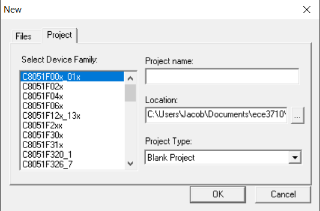

Creating project
================

.. project::

#. 1) Open Silicon Labs IDE
#. 2) Select "Project" -> "New Project" from menu

#. 3) Select "Silicon Labs C8051F380 MCU" as target
#. 4) Select "C8051F380" as device
#. 5) Select "C8051F380" as device
#. 6) Select "C8051F380" as device
#. 7) Select "C8051F380" as device

